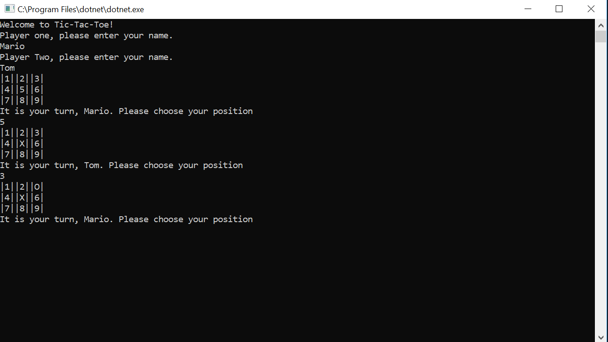

# Lab04-Tic-Tac-Toe
A console application to play a game of Tic-Tac-Toe with two players!

## Rules
Each player will input their names on in the prompt that shows up in the console. Then, each
player takes their turn placing their assigned marker on the board.
The first to get three in a row, whether its horizontally, vertically, or diagnoally,
they win!

## What you need
* Install the latest Visual Studio 2017
* Have Windows OS on your device

## How to Open App
* Fork the Lab04-Tic-Tac-Toe repo from [my GitHub Page](https://github.com/Calamario)
* Git Clone the repo onto your local device
* Open .sln file with Visual Studio
* Click on the green arrow to start
* Navigate through the menu on your console

## Other Details
* This also includes unit testing
* To access, open the UnitTest1.cs under Tic_Tac_Toe_Test in VS2017
* Run the prewritten tests or create your own.

## What it looks like

